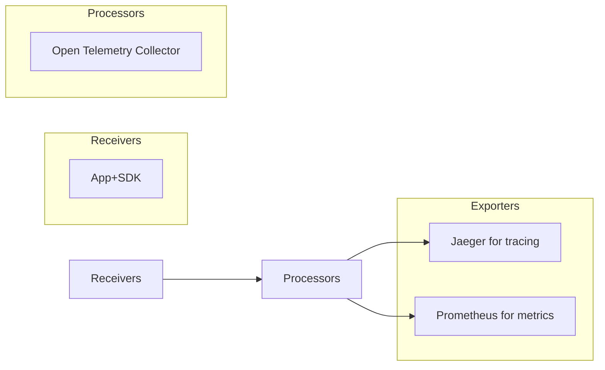

# Concept:
- Prometheus - metric collector
- Loki - Log collector
- Jaeger - Tracing Collector
- Otel-Collector - middle man between the source and prometheus, loki, jaeger
- Grafana: visualizing data
- Storage: ex: Casandra for save data 

# Metrics in Open Telemetry 

- Request Counter 
- Request Duration
- Endpoint Metrics
- Status code Metrics
- Latency Histogram

# Best practices 

## 1. Use Distributed Tracing for Microservices 
## 2. Set sampling rates 
## 3. Use Tags and Attributes
## 4. Monitor key metrics 

# Using Otel-Collector to minpoint to collect log/trace/metric and send to other observability tools


```yaml
receivers:
  otlp:
    protocols:
      grpc:
        endpoint: 0.0.0.0:4317
processors:
extensions:
  health_check: {}
exporters:
  otlp:
    endpoint: jaeger:4317
    tls:
      insecure: true
  prometheus: # metric collector
    endpoint: "0.0.0.0:9090" # endpoints of prometheus receive data
service:
  pipelines:
    traces:
      receivers: [otlp]
      exporters: [otlp]
    metrics:
      receivers: [otlp]
      exporters: [prometheus]
```
- Notes -> Explanation: 
    - Exporters: meaning that where are the exit points for data out of OpenTelemetry Collector
    - Receivers: meaning that where are the entry points (vn: nguon du lieu vao Otel-collector) for data into the OpenTelemetry Collector
    - Processors: define the intermediate steps used to process data ( example like in to elk stack logstash is a middle point to proceed data and send them elastic, in between log source and log persistence)
    - Services: defines the service configuration for the OpenTelemetry Collector
        - ex : **traces:receivers** -> meaning that config for trace task which tracing data source 
- TODO: Draw mermaid diagram to has intuitive about the use case 

