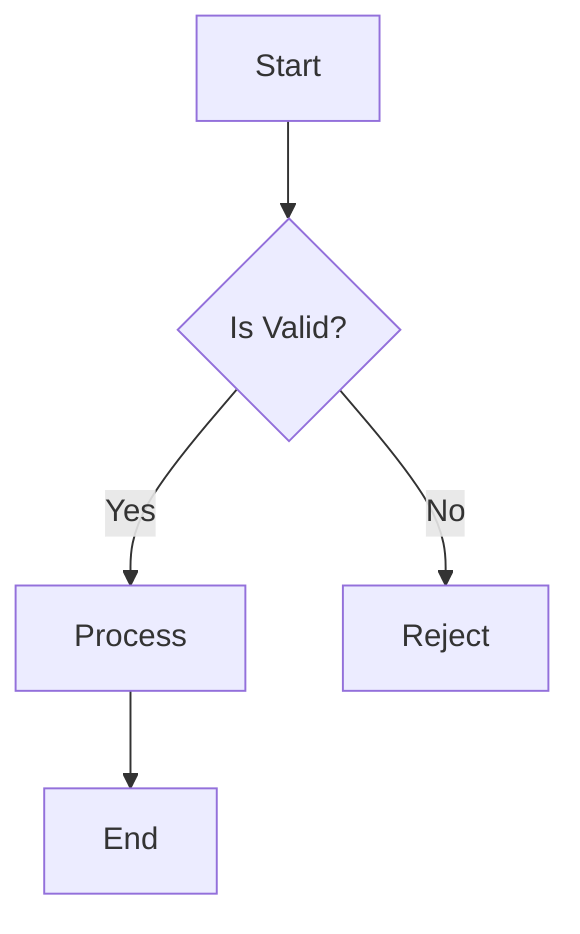
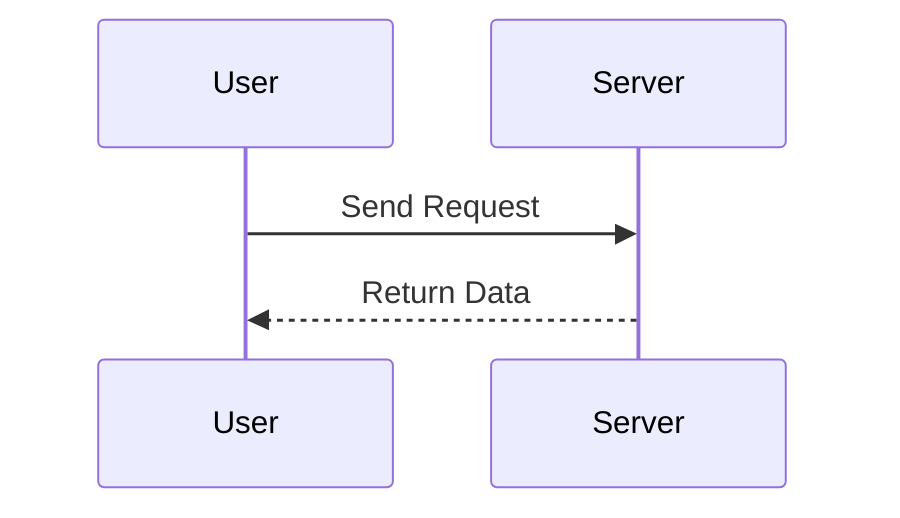
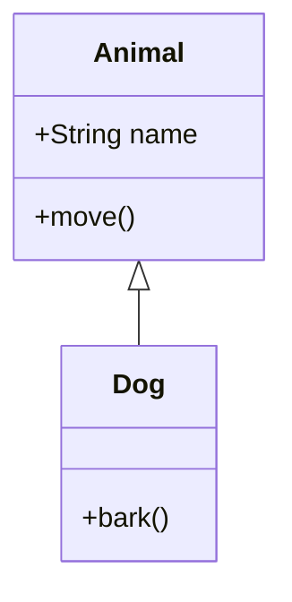

# Mermaid Example 

## I. Begin
- flow chart

```mermaid
flowchart TD
A[Start] --> B{Is Valid?}
B --> |Yes| C[Process]
B --> |No| D[Reject]
C --> E[End]
```

- sequence diagram

```mermaid
sequenceDiagram
    participant User
    participant Server

    User->>Server: Send Request
    Server-->>User: Return Data

```

- uml class 

```mermaid
classDiagram
    class Animal {
        +String name
        +move()
    }

    class Dog {
        +bark()
    }

    Animal <|-- Dog

```